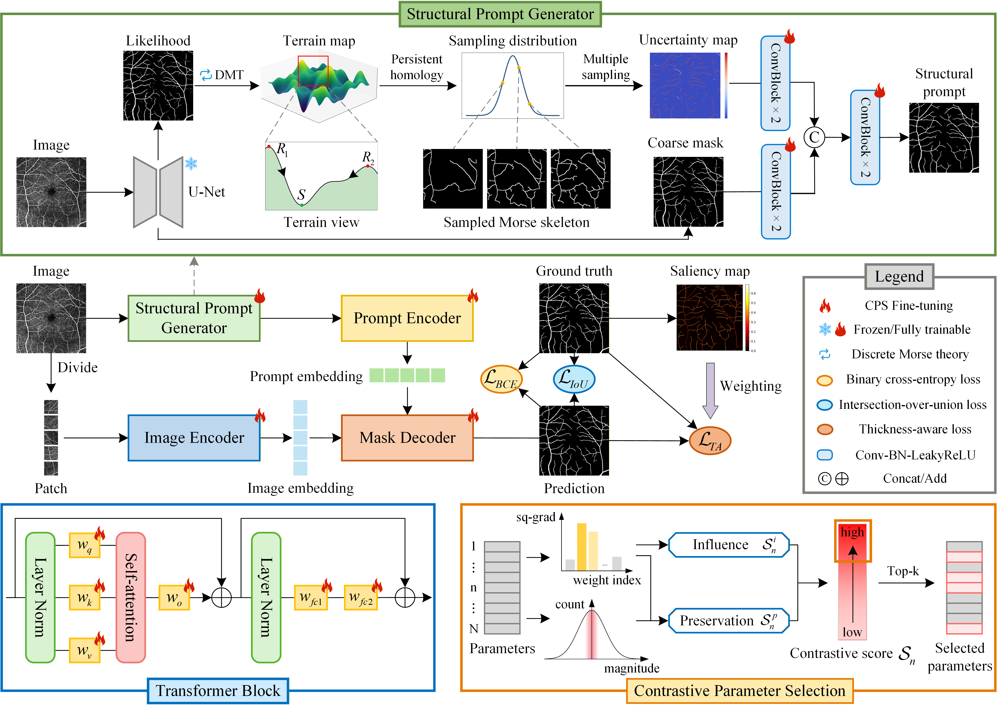
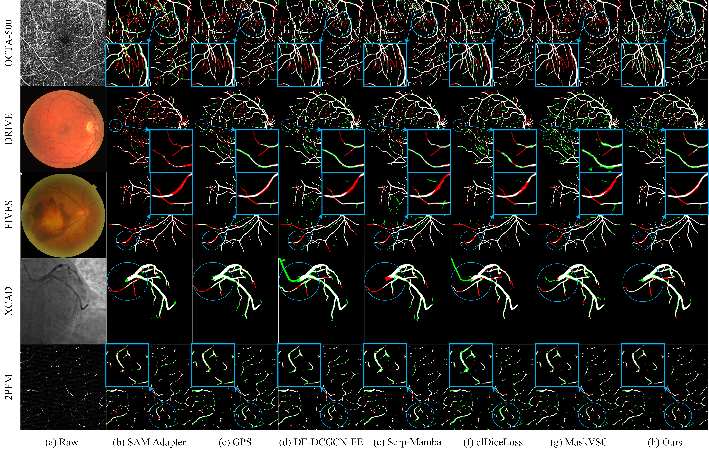

# Informativeness-driven active adaptation of SAM: Structural prompts and contrastive parameter selection for medical tubular segmentation

## Introduction 📜

Accurate segmentation of tubular structures, such as blood vessels and airway trees, is critical across various medical applications. However, this task remains highly challenging due to the diverse global morphologies and thin local structures of these tubular formations. Segment Anything Model (SAM)-based methods have shown impressive performance in image segmentation, yet their reliance on manually crafted prompts makes them unsuitable for fine-grained tubular structures. Moreover, existing fine-tuning methods have not fully explored how to identify the most informative parameters within SAM to maximize adaptation performance. To fill this gap, we introduce a novel framework termed Active Adaptation of SAM (A<sup>2</sup>SAM), which adopts informativeness-driven adaptation as its governing principle for medical tubular segmentation. Specifically, we design a structural prompt generator to automatically produce topology-aware prompts that guide SAM toward true tubular structures. The structural uncertainty embedded in these prompts can capture variations in global morphology. Furthermore, we find that parameters with strong task-specific influence and lower risk of disrupting generalizable knowledge are beneficial for adapting SAM. We define these parameters as contrastive parameters and propose a contrastive parameter selection strategy that modulates squared-gradient influence with magnitude-based preservation. This mechanism enhances adaptation performance in tubular segmentation and preserves SAM’s generalizable knowledge. Finally, we propose a thickness-aware loss function to improve local connectivity in thin structures. The proposed A<sup>2</sup>SAM is validated on five diverse benchmark datasets of medical tubular segmentation. Comprehensive experiments demonstrate that A<sup>2</sup>SAM achieves strong overall performance.

The overall framework of our proposed A<sup>2</sup>SAM:


## Dataset 📂

Datasets can be downloaded from the following sources:

- OCTA-500 Dataset: click [here](https://ieee-dataport.org/open-access/octa-500).
- XCAD Dataset: click [here](https://github.com/AISIGSJTU/SSVS).
- FIVES Dataset: click [here](https://figshare.com/articles/figure/FIVES_A_Fundus_Image_Dataset_for_AI-based_Vessel_Segmentation/19688169/1?file=34969398).
- 2PFM Dataset: click [here](https://figshare.com/articles/dataset/2PFM_dataset_from_MaskVSC/28203014).
- DRIVE Dataset: click [here](https://drive.grand-challenge.org/).

For example, for the DRIVE Dataset, the dataset directory is organized as follows:
```
your_dataset_root_path/DRIVE/
       train/
                imgs/
                    21_training.tif
                    ...
                labs/
                    21_manual1.gif
                    ...
       test/
                imgs/
                    01_test.tif
                    ...
                labs/
                    01_manual1.gif
                    ...
```

## How to Run the Code 🚀
We provide the following step-by-step instructions to facilitate the reproduction of our method.

### Step 0: Environment Installation 🖥️
Requirements: Ubuntu 20.04, CUDA 12.4.

	1. Create a virtual environment: conda create -n A2SAM python=3.7 -y

    2. Activate the environment and navigate to the project directory: conda activate A2SAM, cd /your_dataset_root_path/A2SAM
 
	3. Install PyTorch: pip install torch==1.11.0+cu113 torchvision==0.12.0+cu113 -f https://download.pytorch.org/whl/torch_stable.html

	4. Install other dependencies: pip install -r requirements.txt

### Step 1: Training the U-Net model and generating coarse masks and uncertainty maps 🕸️

We train a U-Net and performed multiple sampling to obtain coarse masks and uncertainty maps.

The dataset directory is updated as follows:
```
your_dataset_root_path/DRIVE/
       train/
                imgs/
                            ...
                labs/
                            ...
                coarse_mask/
                            21_training.npy
                            ...
                uncertainty_map/        
                            21_training_uncertainty.npy
                            ...
       test/
                ...
```

### Step 2: Training A<sup>2</sup>SAM 🔧

You can run the following code to start the training:

`python train.py --config ./configs/cod-sam-vit-b-drive.yaml --name drive_cps_train1`

Arguments:

--config: Specifies the path to the configuration file, which contains the dataset settings, model parameters, and training options. Example configuration files can be found in the `/configs` directory. 

--name: Please specify an identifier for this experiment, e.g., `drive_cps_train1`.

### Step 3: Testing A<sup>2</sup>SAM 📊

You can run the following code to start the testing:

`python test.py --config ./configs/cod-sam-vit-b-drive.yaml --model /data/chenyong/codes/A2SAM/save/drive_cps_train1/model_epoch_best.pth
--save_path /data/chenyong/codes/A2SAM/save/drive_cps_train1/best`

Arguments:

--config: Specifies the path to the configuration file, which contains the dataset settings, model parameters, and testing options. Example configuration files can be found in the `/configs` directory.

--model: Provides the path to the model checkpoint file (`.pth`), which stores the trained weights used for testing.

--save_path: Defines the output directory for testing results (e.g., segmentation outputs and evaluation metrics).

## Results 📈



## Acknowledgements 🤝
Parts of the code are adapted from [GPS](https://github.com/FightingFighting/GPS), [SAM Adapter](https://github.com/tianrun-chen/SAM-Adapter-PyTorch), and [MaskVSC](https://github.com/Zhouyi-Zura/MaskVSC).
